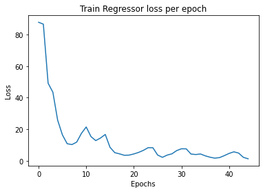

# MaskRCNN

MaskRCNN is the extension of FasterRCNN that addresses the task of instance segmentation, which combined object detection and semantic segmentation into a per-pixel object detection framework. R-CNN is an object detection model that uses high-capacity CNNs to bottom-up region proposals in order to localize and segment objects. It uses selective search to identify a number of bounding-box region candidates (Region of interest) and then extracts features from each region independently for classification. 

<!--   -->
The pipeline is divided into two stages:
1) <b> RPN Network:</b>  
   a] Reponsible for classifying initial anchor boxes into object/background.  
   b] Refine the coordinates of boxes into objects.
   
2) <b> BoxHead | MaskHead:</b>  
   a] BoxHead - Refines and classifies the boxes produced by the RPN Network.  
   b] MaskHead - Predicts a mask of the object that is contained in the refined boxes of the BoxHead.
   
For this project, a subset of COCO dataset was used to detect 3 types of objects: Vehicles, People, and Animals.
  
## Network Architecture

### RPN Head

<table>
  <tr>
      <td align = "center">  </td>
  </tr>
  <tr>
      <td align = "center"> Backbone used for RPN</td>
  </tr>
</table>

<table>
  <tr>
      <td align = "center">  </td>
      <td align = "center">  </td>
  </tr>
  <tr>
      <td align = "center"> RPN Classifer loss</td>
      <td align = "center"> RPN Regressor loss</td>
  </tr>
  <tr>
      <td align = "center">  </td>
      <td align = "center">  </td>
  </tr>
  <tr>
      <td align = "center"> RPN result 1 </td>
      <td align = "center"> RPN result 2</td>
  </tr>
</table>

### BoxHead

<table>
  <tr>
      <td align = "center">  </td>
      <td align = "center">  </td>
  </tr>
  <tr>
      <td align = "center"> BoxHead Classifer loss</td>
      <td align = "center"> BoxHead Regressor loss</td>
  </tr>
  <tr>
      <td align = "center">  </td>
      <td align = "center">  </td>
  </tr>
  <tr>
      <td align = "center"> BoxHead result 1 </td>
      <td align = "center"> BoxHead result 2</td>
  </tr>
</table>

### MaskHead

<table>
  <tr>
      <td align = "center">  </td>
      <td align = "center">  </td>
  </tr>
  <tr>
      <td align = "center"> MaskHead result 1 </td>
      <td align = "center"> MaskHead result 2 </td>
  </tr>
  <tr>
      <td align = "center">  </td>
      <td align = "center">  </td>
  </tr>
  <tr>
      <td align = "center"> MaskHead result 3 </td>
      <td align = "center"> MaskHead result 4 </td>
  </tr>
</table>

## Precision-Recall

**MAP value** : 0.503

   
